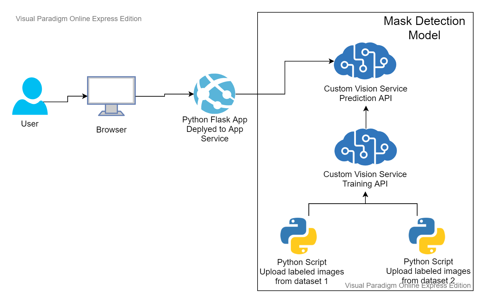

# MaskDetector

## Use Case
Aplikacja pozwala na sprawdzenie czy osoba ze zdjęcia nosi maskę. Jest to aplikacja internetowa, więc można z niej w łatwy sposób korzystać zarówno ze telofonu jak i komputera.

## Architektura

Aplikacja jest dostępna do użytku po przez stronę internetową. Strona jest aplikacją webową napisaną w frameworku Flask w Pythonie i zdeployowaną jako WebApp na Azure. Aplikacja posiada jeden widok za pomocą, którego można wgrać obraz oraz uzyskać odpowiedź dzy osoba na zdjęciu ma założoną maskę (wraz z informacją co do pewności danej predykcji). Klasyfikacja obrazów dokonywana jest dzieki usłudze Custom Vision, która została zasilona obrazami z 2 źródeł:
- [źródło pierwsze](https://www.kaggle.com/andrewmvd/face-mask-detection) - wybrano tylko zdjęcia z jedną osobą, są to głównie zdjęcia ludzie w maskach, [skrypt wykorzystany do uploadu zdjęć wraz z tagami](load_dataset_1_masks_mostly.py)
- [źródło drugie](https://www.kaggle.com/jessicali9530/lfw-dataset) - wybrano 200 losowych zdjęć (każde innej osoby), są to tylko zdjęcia ludzi bez masek, [skrypt wykorzystany do uploadu zdjęć wraz z tagami](load_dataset_2_nomasks.py)

Po zasileniu Custom Vision zdjęciami, został on wytrenowany.

## Wykonane kroki do zbudowania aplikacji

1. Stworzenie zasobu w Azure Custom Vision.
1. Stworzenie projektu w [portalu Custom Vision](www.customvision.ai)
1. Znalezenie zbioru danych ze zdjęciami ludzi w maskach ([źródło pierwsze](https://www.kaggle.com/andrewmvd/face-mask-detection)).
1. Stworzenie skryptu zasilającego Custom Vision zdjęciami ze żródła pierwszego ([skrypt](load_dataset_1_masks_mostly.py)).
1. Trenowanie modelu.
    - Po wytrenowaniu, model nie spełniał zakładanych wymogów - nie potrafił wykrywać, czy osoba na zdjęciu ma założoną maskę czy nie.
    - Krótka analiza pomogła znaleźć problem - w pierwszym zbiorze danych było tylko 50 zdjęc osob bez masek i 250 w maskach
1. Znalezienie drugiego zbioru danych. Tym razem ze zdjęciami ludzi bez masek ([źródło drugie](https://www.kaggle.com/jessicali9530/lfw-dataset)).
1. Stworzenie skryptu zasilającego Custom Vision zdjęciami ze żródła drugiego ([skrypt](load_dataset_2_nomasks.py)).
1. Stworzenie aplikacji webowej we Flasku - [flask_app](flask_app/)
1. Deploy aplikacji do App Service po przez [rozszerzenie do VS Code](https://marketplace.visualstudio.com/items?itemName=ms-azuretools.vscode-azureappservice)

## Odtworznie
1. Stworzenie zasobu w Azure Custom Vision.
1. Pobranie zbiorów danych:
    - [źródło pierwsze](https://www.kaggle.com/andrewmvd/face-mask-detection)
    - [źródło drugie](https://www.kaggle.com/jessicali9530/lfw-dataset)
1. Uzupełnienie skryptów zasilających Custom Vision kluczami oraz adresami nowo stworzonego serwisu Custom Vision.
1. Uruchomienie skryptów.
1. Uzupełnienie w aplikacji Flaskowej kluczy do serwisu Custom Vision.
1. Deploy aplikacji jako WebApp. 

## Demo

[Azure Custom Vision Demo - LINK](https://youtu.be/DSBBAafQCSY)