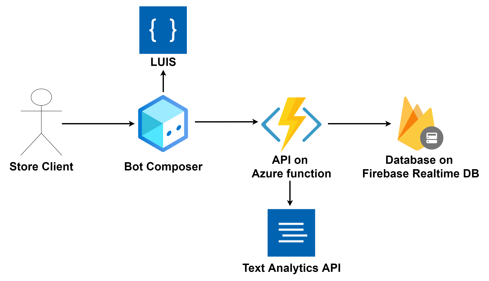

# Sprawozdanie Bot

## Co robi bot?

Stworzony przeze mnie bot jest botem dla sklepu internetowego z elektroniką. Pozwala on klientowi sklepu na 2 podstawowe czynności:
- składanie zamówień
- sprawdzanie stanu w jakim znajduje się zamówienie

Dodatkową funkcją przydatną z perspektywy właściciela sklepu jest ocenianie bota.

## Architektura Bota

Bot został stworzony za pomocą aplikacji Bot Composer. Za pomocą tej aplikacji podpięty został bezpośrednio LUIS, który odpowiada za odgadywanie intencji uzytkownika. Bot wykonuje również zapytania do API napisanym w języku Python i postawionym na Azure Function, które współpracuje z dwoma zewnętrznymi serwisami:
- Text Analytics API czyli kolejny serwis należący do grupy Cognitive Language Services. Wykorzystywany jest on do obsługi wystawiania ocen bota przez użytowników  za pomocą funkcji umożliwiającej badanie sentymentu wypowiedzi.
- Realtime Databse na platformie Firebase wchodząca w skład usług z Google Cloud. Wykorzystywana jest jako prosta baza danych o strukturze JSONa. W bazie danych przechowywane są 3 typy danych: 
	- produkty
	- zamówienia
	- podsumowanie ocen bota

## Wykonane kroki do zbudowania bota
1. Stworzenie projektu w aplikacji ***Bot Framework Composer***
1. Stworzenie Resource grupy **"Azure-AI-Bot"** wraz z usługą ***LUIS***  przez [Portal Azure](https://portal.azure.com)
1. Podpięcie usługi ***LUIS*** do ***Bot Composer'a*** - ustawienie klucza do LUIS w ustawieniach aplikacji Bot Framework Composer
1. Stworzenie drugiej Resource grupy **"Azure-AI-Bot-Backend"** oraz usługi ***Azure Functions*** - konieczne było stworzenie nowej usługi, ponieważ w jednej resource grupie nie można mieć dwóch App Service'ów postawionych na Windowsie oraz Linuxie.
1. Stworzenie za pomocą [Firebase Console](https://console.firebase.google.com) serwisu Realtime Database oraz dodanie przykładowych danych. 
1. Implementacja API w Pythonie, które korzysta z bazy danych Firebase.
1. Stworzenie obsługi dwóch głównych intencji klienta sklepu: składanie zamówienia oraz wyszukiwanie zamówienia.
1. Stworzenie serwisu ***Text Analytics API*** w resource grupie **"Azure-AI-Bot"**.
1. Implementacja dodatkowych funkcji w API związanych z przetwarzaniem nowych ocen oraz zwracanie aktualnej oceny bota.
1. Dodanie do bota dodatkowej wiadomości na powitanie informującej o aktualnym zadowoleniu użytkowników z bota oraz obsługi przyjmowania ocen po złożeniu zamówienia lub po wyszukaniu zamówienia.

## Odtworzenie bota

1. Wdrożenie szablonów ARM dwóch resource grup z folderu [ARM_templates](/ARM_templates/)
1. Ustawienie wszystkich zmiennych konfiguracyjnych dla API w pliku [__init__.py](/Store-Bot/GetProducts/__init__.py)
	- konfiguracja połączenia z Firebase
	- konfiguracja połączenia z Text Analytics API
1. Deploy API do Azure Functions - najlepiej za pomocą VS Code oraz rozszerzenia *ms-azuretools.vscode-azurefunctions*
1. Odtworzenie projektu bota przy pomocy aplikacji Bot Framework Composer
1. Ustawienie odpowiedniego linku oraz klucza do API w Azure Function we wszystkich aktywnościach w bocie.
1. Bot powinien działać poprawnie po naciśnięciu *Test in emulator* 

## Link do demo

[AI on Azure - Bot dla sklepu internetowego](https://youtu.be/l6mIic_CjZ0)